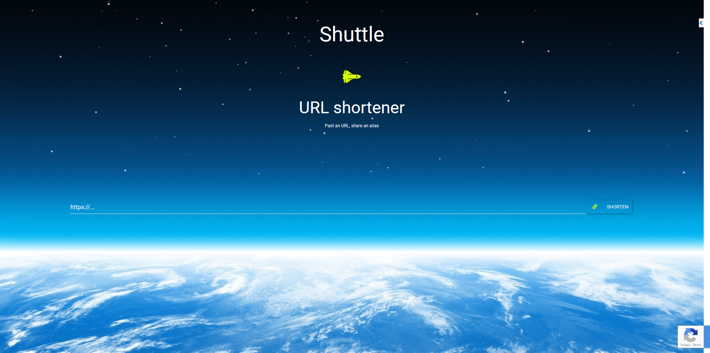

# Shuttle
An url shortener written in Go.

Demo: https://shr.space/



## RCaptcha
In order to prevent bot abuse or spam Shuttle come with RCaptcha support,
fortunately it can be disabled:
```javascript
// globals.js

// RCaptcha activation
export const RCAPTCHA = false;
```

```text
# app.conf

# recaptcha activation
recaptcha.enable = false
```

## Manually install
### Requirements (dev installation)
https://golang.org/doc/install
```
export GOPATH=~/go
export PATH="$PATH:$GOPATH/bin"
export PATH=$PATH:/usr/local/go/bin
```
### Installation
```bash
cp .env.dist .env
```
> Note: You have to complete the configuration depending of the use of RCaptcha, ssl etc (also don't forget about the secret).
> Secret can be generated with `cat /dev/urandom | tr -dc 'a-zA-Z0-9' | fold -w 64 | head -n 1`

Install front-end dependencies
```bash
yarn
```
Compile
```bash
webpack
```
Install back-end dependencies
```bash
go get ./...
```
Run in dev
```bash
source .env && revel run
```
Package for prod
```bash
revel package shuttle prod
```
Run in prod
```bash
tar xzf shuttle.tar.gz && source .env && run.sh
```

## Test
```bash
revel test shuttle
```

## Todo list
- auto install
- dissociate webpack environments
- Mobile application and|or web view
- Command line
- Collect, process and display some interesting stats :)

## Contributors, Sources
- [Creating a URL Shortener with NodeJs, Express, and MongoDB](https://coligo.io/create-url-shortener-with-node-express-mongo/)
